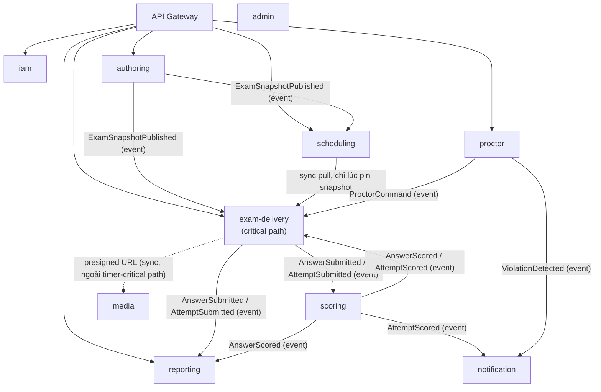

# PTE Platform — Kiến Trúc & 4 ADR

*Bài 2/5 trong series case study PTE Platform. Trạng thái tại 2026-09-07.*

Team không chọn microservice vì "trending" hay vì đội đông. Team 4 người + AI-assisted làm lý do Conway's Law (chia service theo tổ chức team) **yếu đi**, không mạnh lên. Lý do đứng vững duy nhất trong ADR-001: **cô lập rủi ro cho critical path**. Một bulk-import chậm hoặc một kết nối WebSocket giám thị bị leak không được phép ăn vào tài nguyên của học viên đang làm bài — và một modular monolith, dù code sạch đến đâu, vẫn dùng chung 1 process/1 connection pool/1 thread pool nên không cắt được ranh giới đó. Chỉ tách deployable mới làm được.

Từ quyết định gốc đó, 4 ADR khóa lại 4 mặt của hệ thống.

## ADR-001 — Boundary cắt theo capability, không theo actor

Nguyên tắc cứng quan trọng hơn số lượng service:

1. **Hướng phụ thuộc chỉ đi VÀO `exam-delivery` qua event, không bao giờ đi RA** trong lúc học viên đang thi.
2. `exam-delivery` **tự chủ tuyệt đối lúc thi** — đề thi (snapshot) được pin bất biến ngay khi tạo attempt; authoring/scheduling/scoring sập sau đó, học viên vẫn làm bài trọn vẹn.
3. **Data ownership tuyệt đối** — mỗi service 1 database, không service nào query chéo DB của service khác.
4. **Control plane (`admin`) không bao giờ nằm trên critical runtime path** — admin sập không ảnh hưởng học viên.
5. **Service = capability, actor = quyền truy cập.** `authoring` phục vụ cả host lẫn admin — phân biệt bằng RBAC + scope dữ liệu (`tenant_id = NULL` là kho câu hỏi toàn cục), không sinh thêm service riêng cho từng vai.



Chú ý mũi tên: `exam-delivery` chỉ **nhận** event và chỉ gọi sync ra ngoài đúng 1 lần lúc tạo attempt (pin snapshot) — không có cạnh đồng bộ nào chạy giữa lúc học viên đang đếm ngược thời gian.

### Giải "actor nhiều-nhiều" bằng RBAC ở gateway, không sinh service mới

Đây là chỗ nguyên tắc 5 chạm code thật. Actor → service không phải ánh xạ 1-1: `authoring` phục vụ cả `host` (đọc kho global, ghi kho riêng của tenant) lẫn `admin` (ghi kho global). ADR-001 giải bài toán này ở **gateway** trước tiên, rồi tới **scope dữ liệu** — không phải bằng cách tách `authoring` thành `host-authoring` và `admin-authoring`:

```java
// gateway/config/SecurityConfig.java
.authorizeExchange(exchange -> exchange
        .pathMatchers(PUBLIC_PATHS).permitAll()
        .anyExchange().authenticated())
.oauth2ResourceServer(oauth2 -> oauth2.jwt(Customizer.withDefaults()));
```

Gateway xác thực JWT tại biên (không có business logic ở đây), request đã kèm JWT hợp lệ mới lọt vào `authoring`. Bên trong `authoring`, tầng service tự phân xử ai được đọc/ghi gì dựa trên claim trong JWT:

```java
// authoring/service/AuthoringAccessPolicy.java
public boolean canRead(UUID entityTenantId, boolean shared, CurrentUser caller) {
    if (shared) return true;
    if (caller.isPlatformUser()) return true;
    return entityTenantId != null && entityTenantId.equals(caller.tenantId());
}

public boolean canWriteShared(CurrentUser caller) {
    return caller.isPlatformUser();
}
```

`shared` = nội dung do admin tạo (`tenant_id = NULL`) — ai cũng đọc được, chỉ platform user mới ghi. Đây chính là "RBAC ở gateway + scope ở data layer" mà ADR-001 nhắc tới — 2 tầng, không phải 1 service riêng cho mỗi actor.

## ADR-002 — Async-first, saga bằng choreography, không 2PC

Submit bài đi qua **Transactional Outbox**: `exam-delivery` ghi `AttemptAnswer` và một dòng outbox trong cùng 1 transaction cục bộ, rồi trả response ngay — không chờ downstream. Một polling relay (`SELECT ... FOR UPDATE SKIP LOCKED`) đẩy outbox lên RabbitMQ sau đó. Không distributed transaction, không 2PC.

Điểm đáng chú ý: **chấm điểm không tự động chạy khi nộp bài** — đây là quyết định nghiệp vụ, không phải giới hạn kỹ thuật, vì Pearson yêu cầu human review chồng lên AI cho 7 loại task. Chi tiết đầy đủ (kèm code outbox relay thật, endpoint host-command) ở bài [Event-Driven Saga](04-event-driven-saga.md).

Một chi tiết vận hành đáng nói: ADR-002 ban đầu chọn Kafka + Debezium CDC, nhưng đã **đổi sang RabbitMQ** giữa chừng — quyết định đánh giá lại chi phí vận hành so với quy mô một team sinh viên, không phải Kafka làm sai điều gì.

## ADR-003 — Tenant isolation: 3 lớp độc lập, không trộn

"Cùng service" không có nghĩa là "cùng số phận" giữa các tenant. ADR-003 tách rõ 3 lớp cách ly — data, resource, fault/blast-radius — và quy định rõ data-layer phải ép ở tầng Postgres (Row-Level Security), không tin tầng app. Trong thực tế implementation hiện tại, phần enforce cho `authoring` đang nằm ở tầng application (`AuthoringAccessPolicy` phía trên) — RLS ở tầng DB theo đúng ADR-003 là bước tiếp theo team cần khớp lại với thiết kế. Chi tiết đầy đủ, kèm code `RateLimitConfig` thật của gateway, ở bài [Cách Ly Multi-Tenant](05-tenant-isolation.md).

## ADR-004 — Code structure đồng nhất, tham chiếu chéo bằng UUID

Mono-repo (`pte-api/`), Maven multi-module, mỗi service theo đúng 1 layout tầng lớp. Ví dụ package `com.pte.examdelivery` chia `controller` / `service` / `domain` / `messaging.outbox`; package `com.pte.scheduling` chia tương tự với `service.HostCommandService` riêng cho 2 command host-facing (`requestScoring`, `requestPublish`). Quy tắc cứng: một service lưu khóa của service khác bằng cột `UUID publicId` phẳng, tra cứu lại qua API/event — **không bao giờ** dùng JPA relationship xuyên service boundary. Ví dụ: `exam-delivery.PinnedExamSnapshot.snapshotPublicId` trỏ tới `authoring.ExamSnapshot.publicId`, được copy tại thời điểm pin, không join.

## Trade-off đã chấp nhận có chủ đích

Đổi lại cho blast-radius isolation, hệ thống trả giá bằng **eventual consistency** giữa các service (điểm số xuất hiện sau khi nộp bài vài giây tới vài phút), phải tự xây idempotency + distributed tracing (chi phí cố định của kiến trúc phân tán, không phải tùy chọn), và vận hành phức tạp hơn hẳn 1 monolith duy nhất — 10 service nghĩa là 10 database, 10 health check, 1 event backbone phải luôn sống. Đây là lý do ADR-001 nhấn mạnh: microservice ở đây không phải "best practice mặc định" — nó là câu trả lời cho một ràng buộc cụ thể (cô lập critical path), và đội chấp nhận trả giá vận hành để đổi lấy đúng thứ đó.

---

*Bài tiếp theo: [Mã hóa đáp án STRICT](03-ma-hoa-dap-an.md) — RSA-2048 + AES-256-GCM hybrid, tách biệt hoàn toàn khỏi JWT key.*
