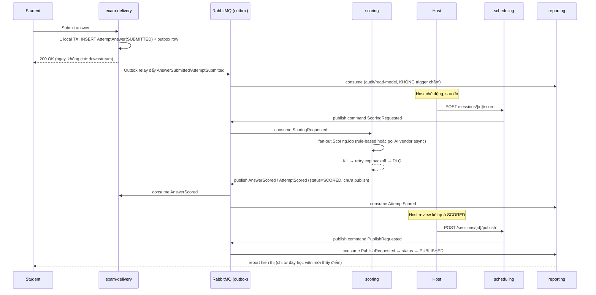

# PTE Platform — Event-Driven Saga: Nộp Bài → Chấm Điểm → Publish

*Bài 4/5 trong series case study PTE Platform. Trạng thái tại 2026-09-07.*

Nộp bài thi xuyên 3 service (`exam-delivery` → `scoring` → `reporting`) là ứng viên kinh điển cho distributed transaction. ADR-002 chọn không dùng 2PC — thay vào đó là **Transactional Outbox + saga choreography**, mỗi service tự quyết bước của mình khi nhận được event, không có nhạc trưởng trung tâm điều phối.

## Vì sao không 2PC

2PC khóa tài nguyên ở tất cả participant cho tới khi mọi bên commit — một participant chậm (gọi AI vendor chấm essay có thể mất vài giây tới vài phút) sẽ giữ transaction treo xuyên suốt. Với `exam-delivery`, điều đó vi phạm thẳng nguyên tắc "zero outbound sync call lúc thi": học viên nộp bài phải nhận response ngay, không chờ downstream.

## Outbox: ghi answer và phát event trong cùng 1 transaction cục bộ

```java
// Trong 1 local TX của exam-delivery:
// INSERT AttemptAnswer (status = SUBMITTED)
// INSERT outbox row (event = AnswerSubmitted / AttemptSubmitted)
```

Cả hai INSERT nằm trong cùng transaction Postgres — loại bỏ dual-write bug (ghi được answer nhưng mất event, hoặc ngược lại). `exam-delivery` trả response cho học viên **ngay khi transaction cục bộ commit** — không chờ relay, không chờ RabbitMQ, không chờ consumer downstream.

## Bên trong outbox relay: `SELECT ... FOR UPDATE SKIP LOCKED`, không phải ShedLock

Toàn bộ 10 service dùng chung 1 lớp base `AbstractOutboxRelay` (`pte-common`) — mỗi service chỉ implement `publish()` để map entry sang exchange/routing-key, phần claim/lock/retry/quarantine sống ở lớp base:

```java
@Scheduled(fixedDelayString = "${pte.outbox.poll-interval-ms:2000}")
public void poll() {
    for (int processed = 0; processed < batchSize; processed++) {
        if (!claimAndProcessOne()) break;
    }
}

private boolean claimAndProcessOne() {
    return Boolean.TRUE.equals(requiresNewTransactionTemplate.execute(status -> {
        List<T> claimed = repository.findClaimableBatch(maxPublishAttempts, PageRequest.of(0, 1));
        if (claimed.isEmpty()) return false;

        T entry = claimed.get(0);
        try {
            publish(entry);
            entry.setPublished(true);
            entry.setPublishedAt(Instant.now());
        } catch (RuntimeException ex) {
            recordFailure(entry, ex);   // tăng publishAttempts, quarantine nếu vượt ngưỡng — KHÔNG re-throw
        }
        repository.save(entry);
        return true;
    }));
}
```

Ba quyết định thiết kế đáng chú ý ở đây:

- **`SKIP LOCKED`, không phải ShedLock.** `SELECT ... FOR UPDATE SKIP LOCKED` cho phép nhiều instance của cùng service poll đồng thời an toàn — mỗi instance tự claim một tập dòng rời nhau. ShedLock giải bài toán khác (chỉ 1 instance được chạy job), dùng nhầm ở đây sẽ triệt tiêu khả năng scale ngang của relay.
- **Mỗi dòng một transaction riêng (`REQUIRES_NEW`), không claim cả batch rồi lặp.** Giữ pessimistic lock xuyên suốt một transaction ngoài trong khi flip trạng thái ở transaction `REQUIRES_NEW` con sẽ khiến UPDATE bên trong tự khóa chính lock mà transaction ngoài đang giữ — self-deadlock cùng process, khác connection. Claim từng dòng trong transaction ngắn tránh hẳn kịch bản này.
- **Lỗi publish không rollback, mà commit bookkeeping thất bại.** `recordFailure` tăng `publishAttempts`, ghi `lastError`, quarantine nếu vượt `maxPublishAttempts` (mặc định 10) — nhưng không `throw` lại, nên transaction `REQUIRES_NEW` này vẫn commit. Một dòng lỗi không kéo theo rollback của dòng đã publish thành công trước đó trong cùng chu kỳ poll.

Cấu hình mặc định qua `application.yml`, override được per-service: `pte.outbox.poll-interval-ms=2000`, `pte.outbox.batch-size=100`, `pte.outbox.max-publish-attempts=10`, `pte.outbox.confirm-timeout-ms=5000`. `publishAndConfirm` gọi `rabbitTemplate.waitForConfirmsOrDie` — chặn tới khi broker xác nhận nhận message, throw nếu timeout hoặc bị nack, để tầng gọi (`claimAndProcessOne`) xử lý retry/quarantine thay vì âm thầm mất event.

## Host-gated: submit không kéo theo chấm điểm

Đây là quyết định nghiệp vụ, không phải giới hạn kỹ thuật: Pearson yêu cầu human review chồng lên kết quả AI cho 7 loại task, nên hệ thống cần một điểm dừng để con người can thiệp trước khi học viên thấy điểm. Hai command này nằm ở `scheduling`, không nằm trong `scoring` — `scoring` chỉ thực thi khi được lệnh, không tự quyết:

```java
// SessionController.java (scheduling)
/** Host command: trigger scoring for every submitted attempt in this session (host-gated, ADR-002). */
@PostMapping("/{publicId}/score")
@PreAuthorize("hasRole('HOST_ADMIN')")
public ApiResponse<Void> requestScoring(@PathVariable UUID publicId) {
    hostCommandService.requestScoring(publicId, currentUser());
    return ApiResponse.success(null);
}

/** Host command: publish scored results to students. */
@PostMapping("/{publicId}/publish")
@PreAuthorize("hasRole('HOST_ADMIN')")
public ApiResponse<Void> requestPublish(@PathVariable UUID publicId) {
    hostCommandService.requestPublish(publicId, currentUser());
    return ApiResponse.success(null);
}
```

Gọi thử (sau khi học viên đã nộp bài, JWT của host có role `HOST_ADMIN`):

```bash
curl -X POST http://localhost:8080/api/scheduling/sessions/{sessionPublicId}/score \
  -H "Authorization: Bearer $HOST_JWT"

# Sau khi host review kết quả SCORED:
curl -X POST http://localhost:8080/api/scheduling/sessions/{sessionPublicId}/publish \
  -H "Authorization: Bearer $HOST_JWT"
```



State model của một attempt: `SUBMITTED → SCORING → SCORED → PUBLISHED`. `reporting` chỉ expose attempt ở trạng thái `PUBLISHED` — `SCORED` nhưng chưa publish chỉ host nhìn thấy.

## Cross-cutting bắt buộc: idempotency + tracing

RabbitMQ chỉ đảm bảo at-least-once — một event có thể bị giao lại. Mọi consumer dedup theo `eventId` truyền qua AMQP `messageId` (`properties.setMessageId(entry.getId().toString())` trong `publishAndConfirm`). Song song đó, OpenTelemetry gắn correlation-id theo `attemptId` chạy xuyên suốt saga — không có nó thì không cách nào debug được một luồng đi qua 3-4 service khác nhau.

## Quyết định vận hành: đổi từ Kafka sang RabbitMQ giữa chừng

ADR-002 ban đầu thiết kế event backbone bằng Kafka + Debezium CDC + Schema Registry. Ngày 2026-07-31, team đánh giá lại và chuyển hẳn sang RabbitMQ + outbox relay tự viết ở tầng ứng dụng như trên. Lý do không phải Kafka làm sai điều gì — là **chi phí vận hành 3 hệ thống (Kafka, Debezium, Schema Registry) không tương xứng với quy mô một team sinh viên**, không phải hệ throughput cao.

Cái mất đi khi bỏ Kafka: replay-from-beginning tự động (Kafka giữ log dài hạn, RabbitMQ thì không), và per-aggregate ordering tự động qua partition. Cả hai được bù bằng cơ chế tự xây: `reporting` có endpoint rebuild qua sync-pull thay vì replay, còn 2 luồng cần ordering nghiêm ngặt (`proctor→exam-delivery`, `exam-delivery→scoring`) dùng single-queue + consumer concurrency=1 thay vì dựa vào partition. Cái được lại: vận hành đơn giản hẳn — 1 broker công nghệ duy nhất, không cần Debezium/Schema Registry/Kafka Connect. Bản chất saga (host-gated scoring, outbox pattern, choreography không 2PC) không đổi — chỉ đổi *cách* event được vận chuyển, không đổi *ngữ nghĩa* nghiệp vụ.

---

*Bài tiếp theo: [Cách Ly Multi-Tenant](05-tenant-isolation.md) — 3 lớp isolation để một tổ chức không ảnh hưởng tổ chức khác.*
