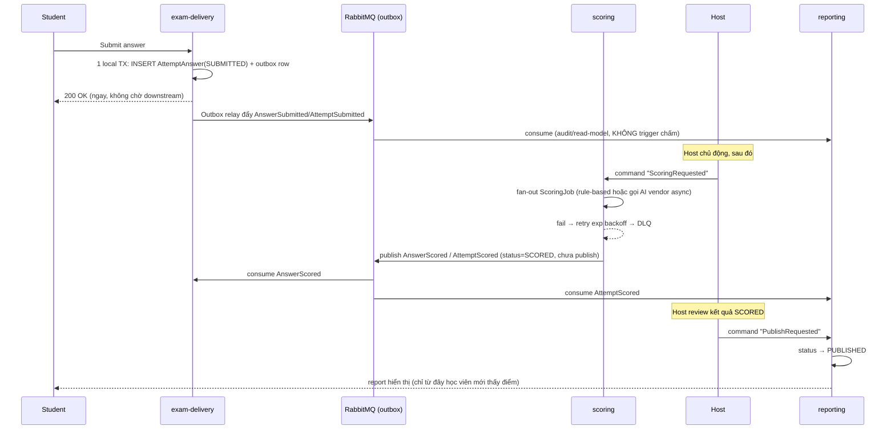

# PTE Platform — Event-Driven Saga: Nộp Bài → Chấm Điểm → Publish

*Bài 4/5 trong series case study PTE Platform. Trạng thái tại 2026-09-07.*

Nộp bài thi xuyên 3 service (`exam-delivery` → `scoring` → `reporting`) là ứng viên kinh điển cho distributed transaction. ADR-002 chọn không dùng 2PC — thay vào đó là **Transactional Outbox + saga choreography**, mỗi service tự quyết bước của mình khi nhận được event, không có nhạc trưởng trung tâm điều phối.

## Vì sao không 2PC

2PC khóa tài nguyên ở tất cả participant cho tới khi mọi bên commit — một participant chậm (gọi AI vendor chấm essay có thể mất vài giây tới vài phút) sẽ giữ transaction treo xuyên suốt. Với `exam-delivery`, điều đó vi phạm thẳng nguyên tắc "zero outbound sync call lúc thi": học viên nộp bài phải nhận response ngay, không chờ downstream.

## Outbox: ghi answer và phát event trong cùng 1 transaction cục bộ

```java
// Trong 1 local TX của exam-delivery:
// INSERT AttemptAnswer (status = SUBMITTED)
// INSERT outbox row (event = AnswerSubmitted / AttemptSubmitted)
```

Cả hai INSERT nằm trong cùng transaction Postgres — loại bỏ dual-write bug (ghi được answer nhưng mất event, hoặc ngược lại). Một polling relay riêng (`AbstractOutboxRelay`, dùng `SELECT ... FOR UPDATE SKIP LOCKED`) chạy nền, đẩy các dòng outbox lên RabbitMQ. `exam-delivery` trả response cho học viên **ngay khi transaction cục bộ commit** — không chờ relay, không chờ RabbitMQ, không chờ consumer downstream.

## Host-gated: submit không kéo theo chấm điểm

Đây là quyết định nghiệp vụ, không phải giới hạn kỹ thuật: Pearson yêu cầu human review chồng lên kết quả AI cho 7 loại task, nên hệ thống cần một điểm dừng để con người can thiệp trước khi học viên thấy điểm.



State model của một attempt: `SUBMITTED → SCORING → SCORED → PUBLISHED`. Hai quyết định thuộc về host, không tự động: *khi nào* chấm, và *có* publish cho học viên không. `reporting` chỉ expose attempt ở trạng thái `PUBLISHED` — `SCORED` nhưng chưa publish chỉ host nhìn thấy.

## Cross-cutting bắt buộc: idempotency + tracing

RabbitMQ chỉ đảm bảo at-least-once — một event có thể bị giao lại. Mọi consumer dedup theo `eventId` truyền qua AMQP `messageId`. Song song đó, OpenTelemetry gắn correlation-id theo `attemptId` chạy xuyên suốt saga — không có nó thì không cách nào debug được một luồng đi qua 3-4 service khác nhau.

## Quyết định vận hành: đổi từ Kafka sang RabbitMQ giữa chừng

ADR-002 ban đầu thiết kế event backbone bằng Kafka + Debezium CDC + Schema Registry. Ngày 2026-07-31, team đánh giá lại và chuyển hẳn sang RabbitMQ + một outbox relay tự viết ở tầng ứng dụng. Lý do không phải Kafka làm sai điều gì — là **chi phí vận hành 3 hệ thống (Kafka, Debezium, Schema Registry) không tương xứng với quy mô một team sinh viên**, không phải hệ throughput cao.

Cái mất đi khi bỏ Kafka: replay-from-beginning tự động (Kafka giữ log dài hạn, RabbitMQ thì không), và per-aggregate ordering tự động qua partition. Cả hai được bù bằng cơ chế tự xây: `reporting` có endpoint rebuild qua sync-pull thay vì replay, còn 2 luồng cần ordering nghiêm ngặt (`proctor→exam-delivery`, `exam-delivery→scoring`) dùng single-queue + consumer concurrency=1 thay vì dựa vào partition. Cái được lại: vận hành đơn giản hẳn — 1 broker công nghệ duy nhất, không cần Debezium/Schema Registry/Kafka Connect. Bản chất saga (host-gated scoring, outbox pattern, choreography không 2PC) không đổi — chỉ đổi *cách* event được vận chuyển, không đổi *ngữ nghĩa* nghiệp vụ.

---

*Bài tiếp theo: [Cách Ly Multi-Tenant](05-tenant-isolation.md) — 3 lớp isolation để một tổ chức không ảnh hưởng tổ chức khác.*
