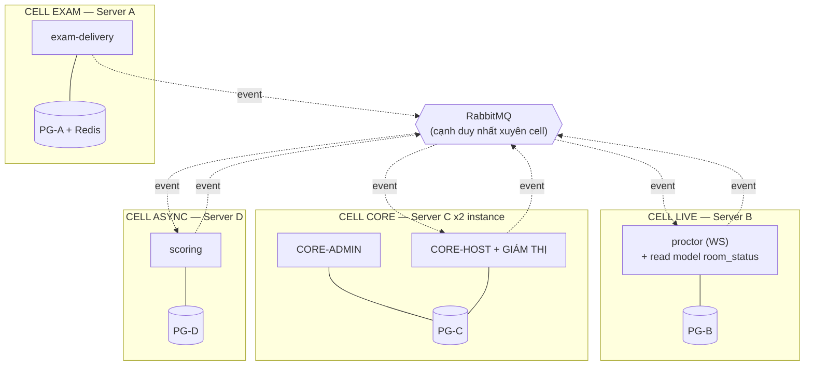

# PTE Platform — Tái Kiến Trúc Cell-Based: 10 Service Nhưng Chỉ 1 Vùng Sập

*Bài 15 — phần tiếp nối series case study PTE Platform. Trạng thái tại 2026-09-09. Khác 14 bài trước (mô tả hệ thống **đã build**), bài này là **đề xuất tái kiến trúc** chưa triển khai.*

Sau khi 10 service chạy được end-to-end, câu hỏi tự nhiên nảy ra: *"nếu server của admin sập thì host có bị không? giám thị có bị không?"*

Đi tìm câu trả lời trong chính codebase thì phát hiện một sự thật khó chịu: **hệ thống có 10 service nhưng chỉ có 1 vùng sập.** Mục tiêu gốc của ADR-001 — cô lập rủi ro cho critical path — chưa từng đạt được ngày nào, dù đã trả đủ giá của microservice.

Bài này ghi lại: bằng chứng của vấn đề, khái niệm cell, và phương án triển khai 5 bước.

---

## Phần 1 — Lý do: vì sao 10 service vẫn là 1 vùng sập

### Bằng chứng 1: cả 10 database nằm trên một container Postgres

```yaml
# pte-api/docker-compose.yml
postgres:
  image: postgres:17
  container_name: pte-postgres
  command: ["postgres", "-c", "max_connections=200", ...]
```

```yaml
# pte-api/docker-compose.services.yml
iam:           IAM_DB_URL:           jdbc:postgresql://postgres:5432/iam
admin:         ADMIN_DB_URL:         jdbc:postgresql://postgres:5432/admin
authoring:     AUTHORING_DB_URL:     jdbc:postgresql://postgres:5432/authoring
exam-delivery: EXAM_DELIVERY_DB_URL: jdbc:postgresql://postgres:5432/exam_delivery
# ... 6 service còn lại, cùng một host `postgres`
```

ADR-001 quy định *"data ownership tuyệt đối — mỗi service 1 database"*. Điều đó **đúng ở tầng logic**: 10 database riêng, 10 credential riêng, không service nào query chéo. Nhưng ở tầng vật lý chúng dùng chung một process Postgres, một filesystem, một `max_connections=200`.

Hệ quả cụ thể:

- `postgres` restart / hết disk / lock table → **cả 10 service chết đồng thời**.
- 10 service × Hikari pool mặc định (10) = 100 connection. Chính comment trong file đã ghi nhận điều này chạm trần 100-connection mặc định và phải nâng lên 200. Đó là **một pool chung không có hạn ngạch theo service** — service nào mở nhiều connection trước thì service khác đói.

Một `admin` bulk-import 10.000 câu hỏi có thể chiếm sạch connection, và `exam-delivery` — thứ được cho là quan trọng nhất — đứng chờ.

Tương tự với `redis` (1 container), `rabbitmq` (1 container), `gateway` (1 instance).

### Bằng chứng 2: sáu cạnh đồng bộ, và tất cả đều nằm ở cửa vào phòng thi

ADR-001 có một nguyên tắc bất biến: *"hướng phụ thuộc chỉ đi VÀO `exam-delivery`, không bao giờ đi RA."*

Thực tế trong code có 6 cạnh đồng bộ xuyên service:

| # | Từ → Đến | Vị trí |
|---|---|---|
| 1 | `exam-delivery` → `scheduling` | `SnapshotPinService:63` — `checkEntitlement` |
| 2 | `exam-delivery` → `authoring` | `SnapshotPinService:68` — `fetchContent` |
| 3 | `exam-delivery` → `media` | `SnapshotPinService:186,205` — `presignGet` audio/ảnh |
| 4 | `proctor` → `scheduling` | `ProctorSessionService:63` — `checkAssignment` |
| 5 | `reporting` → `exam-delivery` | export rebuild read model |
| 6 | `reporting` → `scoring` | export rebuild read model |

Ba cạnh đầu nằm trọn trong `SnapshotPinService`:

```java
// exam-delivery/service/SnapshotPinService.java
SchedulingEntitlementResponse entitlement = schedulingClient.checkEntitlement(sessionPublicId, studentPublicId);   // :63
AuthoringSnapshotContentResponse content   = authoringClient.fetchContent(entitlement.snapshotPublicId());          // :68
MediaPresignedDownloadResponse presigned   = mediaClient.presignGet(audioPromptRef, audioUrlTtlSeconds, tenantId);  // :186
```

Đây là chi tiết dễ đọc nhầm nhất của cả kiến trúc. ADR nói `exam-delivery` **tự chủ tuyệt đối lúc thi** — và điều đó **đúng**: sau khi snapshot được pin, học viên làm bài mà không gọi ra ngoài một lần nào.

Nhưng "lúc thi" **không bao gồm khoảnh khắc bước vào phòng thi**. Và khoảnh khắc đó chính là lúc:

- 500 học viên bấm "Bắt đầu" trong cùng một phút,
- mỗi lượt bấm kéo theo **3 cú gọi HTTP đồng bộ** sang 3 service khác,
- tức đỉnh tải đồng thời trùng khít với đỉnh phụ thuộc chéo.

> **Cửa sổ dễ tổn thương không phải lúc đang thi, mà là lúc vào phòng thi — và đó cũng là lúc tải cao nhất.**

Cạnh số 4 lặp lại đúng khuôn đó cho giám thị:

```java
// proctor/service/ProctorSessionService.java
@Transactional
public ProctorSessionResponse open(UUID sessionPublicId, CurrentUser caller) {
    return proctorSessionRepository
            .findBySessionPublicIdAndProctorPublicIdAndTenantIdAndStatus(..., ProctorSessionStatus.ACTIVE)
            .map(mapper::toResponse)
            .orElseGet(() -> openNew(sessionPublicId, proctorPublicId));   // ← chỉ nhánh này gọi ra ngoài
}

private ProctorSessionResponse openNew(UUID sessionPublicId, UUID proctorPublicId) {
    SchedulingProctorAssignmentResponse assignment = schedulingClient.checkAssignment(sessionPublicId, proctorPublicId);
    if (assignment == null) {
        throw new ProctorAssignmentCheckFailedException();   // ← scheduling sập là rơi vào đây
    }
    ...
}
```

Hành vi thật khi `scheduling` sập:

| Tình huống | Kết quả |
|---|---|
| Giám thị **đã mở phiên** (có session `ACTIVE` trong DB `proctor`) | ✅ đọc DB local, giám sát bình thường |
| Giám thị **mở phiên mới** / vào ca mới / F5 sau khi phiên đóng | ❌ circuit breaker trả `null` → `ProctorAssignmentCheckFailedException` |

Kịch bản xấu nhất: `scheduling` sập lúc 8:00, ca thi 8:05, chưa giám thị nào kịp mở phiên. Kết quả: **học viên thi bình thường, không một giám thị nào vào được phòng.** Kỳ thi diễn ra hoàn toàn không giám sát — tệ hơn nhiều so với việc hoãn thi, vì kết quả thu về không có giá trị pháp lý.

### Bằng chứng 3: sự cố đã xảy ra thật

Không cần suy đoán — comment trong `docker-compose.services.yml` ghi lại nguyên văn một sự cố đã gặp:

> `MEDIA_URL` bị thiếu → `MediaClient.presignGet` mặc định về `localhost:8090` (không tới được từ trong container) → circuit-breaker fallback → trả `null` → `AudioResolutionFailedException` → **503 ở attempt-start** cho mọi item có `audioPromptRef`.

Một service phụ trợ — thứ chỉ làm nhiệm vụ **ký một chuỗi URL** — làm học viên không vào thi được. Đó chính xác là kịch bản mà toàn bộ ADR-001 được viết ra để ngăn chặn.

### Vì sao "tách theo actor" không giải quyết được

Phản xạ đầu tiên khi gặp vấn đề này là: tách hẳn `admin-service`, `host-service`, `student-service` cho ba nền tảng độc lập.

Cách đó **thêm 3 service nữa và không sửa được gì**:

- Vẫn 1 Postgres → vẫn 1 vùng sập.
- Vẫn 6 cạnh đồng bộ → vẫn 503 ở attempt-start.
- Và tệ hơn: `admin`, `host`, `giám thị` **thao tác trên cùng một dữ liệu**. Host tạo câu hỏi trong `authoring`, admin duyệt *chính bảng đó*, giám thị đọc *chính lịch thi đó*. Chúng khác nhau ở `tenant_id` scope và quyền hạn — không khác nhau ở dữ liệu.

Tách database theo actor nghĩa là **nhân đôi dữ liệu và đồng bộ hai chiều** — đắt và sinh lỗi, đổi lại không được gì.

Đây chính là điều nguyên tắc 5 của ADR-001 đã nói từ đầu: **service = capability, actor = RBAC + scope.** Nguyên tắc đó vẫn đúng. Vấn đề nằm ở chỗ khác.

> Trực giác "tách admin / host / student" đúng **một phần ba**. `student` thật sự khác biệt — khác dữ liệu (snapshot bất biến), khác hồ sơ tải (burst), khác mức chịu lỗi (bằng 0). `admin` / `host` / `giám thị` thì không.

---

## Phần 2 — Giải pháp: cell

### Cell là gì

**Cell = một khoang kín**: một server riêng + một database riêng + một process, chứa một hoặc nhiều module bên trong. Thủng khoang này, khoang kia không biết gì.

Tên mượn từ khoang kín trên tàu thủy — thủng một khoang, tàu vẫn nổi. Cách gọi khác cùng ý: *bulkhead*.

Điểm dễ nhầm nhất: **cell không phải service**.

| | Service | Cell |
|---|---|---|
| Là đơn vị của | **code** | **thiệt hại khi sập** |
| Số lượng hiện tại | 10 | **1** |
| Quan hệ | một cell chứa nhiều service | |

Hôm nay hệ thống có 10 khoang **hình vẽ** nhưng 1 khoang **thật**, vì đáy tàu thông nhau ở tầng Postgres.

### Nguyên tắc cắt: theo hồ sơ tài nguyên

Cái làm các service giết nhau không phải "domain", mà là **kiểu tài nguyên bị vắt kiệt**. Hai module cạn kiệt cùng một kiểu thì tách ra không mua được gì — chỉ tốn thêm server.

> **Số cell = số kiểu cạn kiệt tài nguyên khác nhau, cộng 1 cho tất cả phần còn lại.**

| Cell | Chứa | Cạn kiệt theo | Chịu downtime |
|---|---|---|---|
| **EXAM** | `exam-delivery` | latency, connection pool | ❌ bằng 0 |
| **LIVE** | `proctor` (WebSocket) | file descriptor, RAM/kết nối | ⚠️ suy giảm được |
| **CORE** | `iam` `admin` `authoring` `scheduling` `reporting` `notification` | gần như không | ✅ 5–10 phút |
| **ASYNC** | `scoring` | CPU + chờ AI vendor (30s+) | ✅ queue hấp thụ |

Lý do từng cell tồn tại:

**EXAM** — thứ duy nhất trong hệ thống **không retry được**. Chấm chậm thì chấm sau; báo cáo lỗi thì chạy lại; học viên đang thi mà sập thì mất bài, không đền được. Ba cell còn lại tồn tại **chỉ để bảo vệ cell này**.

**LIVE** — WebSocket bind theo *số kết nối đồng thời*, `exam-delivery` bind theo *latency*. 500 học viên thi 2 tiếng = 500 kết nối WS mở liên tục, trong khi `exam-delivery` chỉ xử lý vài chục request/giây. Hai trục scale hoàn toàn khác nhau, lại **bật đồng thời trong cùng một kỳ thi** — đây là cặp nguy hiểm nhất nếu nhốt chung. Tách ra để `proctor` được phép chết riêng mà không hủy kỳ thi.

**ASYNC** — nhốt riêng thứ có latency **không do mình kiểm soát**. AI vendor treo 30s/request giữ thread rất lâu, mà `scoring` chạy đúng lúc vừa xong ca thi này và ca thi khác đang diễn ra. Theo thiết kế host-gated, chấm chậm 10 phút không ai biết.

**CORE** — sáu module này **cùng một hồ sơ**: traffic thấp, chịu được downtime, không ai đang thi phụ thuộc vào chúng theo thời gian thực. Tách chúng thành 6 cell không mua thêm khả năng chống sập nào, chỉ tốn 6 server + 6 pipeline. **Đây là chỗ chi phí vận hành giảm xuống.**

`iam` nằm ở tier thấp vẫn an toàn: JWT được verify **local** bằng JWKS đã cache ở mỗi service. `iam` chỉ cần thiết lúc *login*. Học viên đã vào phòng thi thì `iam` chết không ảnh hưởng.

### Nhìn theo trục thời gian

```
        trước kỳ thi        TRONG kỳ thi         sau kỳ thi
CORE    ████████████        ·····                ····
EXAM    ·                   ████████████         ·
LIVE    ·                   ████████████         ·
ASYNC   ·                   ·                    ████████████
```

Ba khoảng thời gian gần như không chồng lấn — mỗi server chỉ chịu tải trong khung giờ của nó, không tranh nhau.

Cắt theo actor thì cả 3 nhóm đều hoạt động ở **cả ba** khung, vì host thao tác trước, trong và sau kỳ thi. Không tách được tải theo thời gian.

### Giám thị bị chẻ làm hai

Giám thị **không phải một actor kỹ thuật riêng** — nó là host với scope hẹp hơn (xem được trạng thái phòng thi, nhưng không import học viên, không sửa role), cộng đúng một năng lực thật sự riêng: giám sát realtime.

| Nửa | Nội dung | Cell |
|---|---|---|
| **Giao diện quản lý** | danh sách phòng thi, thí sinh, trạng thái — giống host, bớt quyền | **CORE** |
| **Realtime** | WS session, luồng vi phạm, ra lệnh (`ProctorStompController`) | **LIVE** |

Phần "bị hạn chế chức năng" là **RBAC scope**, không phải kiến trúc — cùng endpoint `authoring`/`scheduling`, khác quyền.

**Lỗ nguy hiểm mà điều này lộ ra:** dữ liệu "trạng thái thi của phòng thi" nằm ở `exam-delivery`, tức CELL EXAM. Nếu giao diện giám thị đọc trạng thái bằng sync call thì đó là **read đồng bộ đâm thẳng vào cell được bảo vệ nhất, đúng lúc tải cao nhất** — mỗi giám thị poll vài giây/lần, nhân số phòng. Nguy hiểm hơn cả `MediaClient`, vì nó lặp liên tục thay vì một lần lúc pin.

Bắt buộc phải là **read model event-fed**, và đẩy qua chính WebSocket đang mở thay vì polling:

```
CELL EXAM                              CELL LIVE
exam-delivery                          proctor
  AttemptStarted   ──┐
  AttemptSubmitted ──┼── RabbitMQ ──▶  cập nhật read model room_status
  TaskExpired      ──┘                        │
                                              ▼
                                    push qua WS đang mở → giám thị
                                    (0 call sang EXAM)
```

Trạng thái trễ vài giây — chấp nhận được hoàn toàn cho việc theo dõi phòng thi, đổi lại EXAM không bao giờ bị giám thị làm chậm.

Hiện `proctor` chỉ **publish** event (`ProctorOutboxRelay`, `OutboxWriter`), chưa **consume** event nào — read model này chưa tồn tại.

### Kiến trúc đích



Sau tái kiến trúc: **không còn một cuộc gọi đồng bộ nào xuyên cell.** Đó là định nghĩa duy nhất của "một bên sập, bên kia sống" — không phải số lượng container.

### CORE chạy hai instance từ cùng một artifact

```
        Server C1                    Server C2
   ┌─ CORE-ADMIN ──────┐       ┌─ CORE-HOST ───────┐
   │ cell-core.jar     │       │ cell-core.jar     │  ← CÙNG một file
   │ pool: 20 conn     │       │ pool: 60 conn     │  ← khác cấu hình
   │ route: ADMIN role │       │ route: HOST,      │
   │                   │       │        PROCTOR    │
   └─────────┬─────────┘       └─────────┬─────────┘
             └──────────┬────────────────┘
                  ┌─────▼─────┐
                  │   PG-C    │  ← VẪN CHUNG
                  └───────────┘
```

Gateway route theo role trong JWT. Admin bulk-import 10.000 câu → nghẽn/OOM **process trên C1**, host và giám thị trên C2 không hề hấn.

Đây chính là ý tưởng "tách nền tảng theo actor" ban đầu — nhưng đặt **đúng chỗ**: tinh chỉnh bậc hai *bên trong* một cell ở tier thấp, không phải làm ranh giới chính của hệ thống.

### Bán kính thiệt hại sau tái kiến trúc

| Sập | Học viên thi | Giám thị (UI) | Giám thị (realtime) | Host | Admin |
|---|---|---|---|---|---|
| CORE toàn bộ | ✅ | ❌ | ✅ | ❌ | ❌ |
| Server C1 (admin) | ✅ | ✅ | ✅ | ✅ | ❌ |
| Server C2 (host) | ✅ | ❌ | ✅ | ❌ | ✅ |
| LIVE | ✅ | ✅ | ❌ | ✅ | ✅ |
| ASYNC | ✅ | ✅ | ✅ | ✅ (chấm dồn queue) | ✅ |
| EXAM | ❌ | ✅ (số liệu đứng yên) | ✅ | ✅ | ✅ |

Đọc dòng CORE: kỳ thi **vẫn chạy, vẫn được giám sát realtime** — chỉ mất phần quản trị. Đó là mức suy giảm đúng.

Cột "Học viên thi" chỉ còn **một** ô đỏ, và nó thuộc về cell được bảo vệ bằng cả ba cell còn lại.

---

## Phần 3 — Phương án triển khai

### Tổng quan 5 bước

| # | Việc | Sửa code | Được gì |
|---|---|---|---|
| 1 | Tách Postgres 1 → 4 instance | **0 dòng** | Hết phụ thuộc 1 database |
| 2 | Xóa 6 cạnh đồng bộ | nặng nhất | Cell thật sự độc lập |
| 3 | `media` → library nhúng | nhẹ | Bớt 1 service + hết 503 attempt-start |
| 4 | Gộp assembly: 10 pom → 4 | cơ học | Chi phí vận hành giảm ~60% |
| 5 | Tách 4 server + CORE ×2 | **0 dòng** | Cô lập compute, cô lập admin ↔ host |

Bước 1 làm được ngay, chỉ sửa biến môi trường. Bước 2 là toàn bộ khối lượng thật.

### Bước 1 — Tách failure domain ở tầng hạ tầng

Đổi 10 `*_DB_URL` trỏ về 4 Postgres instance thay vì 1:

```yaml
# pte-api/docker-compose.yml — 4 instance thay cho 1
services:
  pg-exam:   { image: postgres:17, command: ["postgres", "-c", "max_connections=100"] }
  pg-live:   { image: postgres:17, command: ["postgres", "-c", "max_connections=50"]  }
  pg-core:   { image: postgres:17, command: ["postgres", "-c", "max_connections=100"] }
  pg-async:  { image: postgres:17, command: ["postgres", "-c", "max_connections=50"]  }
```

```yaml
# pte-api/docker-compose.services.yml
exam-delivery: EXAM_DELIVERY_DB_URL: jdbc:postgresql://pg-exam:5432/exam_delivery
proctor:       PROCTOR_DB_URL:       jdbc:postgresql://pg-live:5432/proctor
authoring:     AUTHORING_DB_URL:     jdbc:postgresql://pg-core:5432/authoring
scoring:       SCORING_DB_URL:       jdbc:postgresql://pg-async:5432/scoring
# ...
```

Không sửa một dòng Java nào — vì ADR-001 đã cấm query chéo database từ đầu, nên không có JOIN nào bị gãy. **Đây là lợi ích trả về từ một quyết định đúng làm từ trước.**

Redis cũng tách: `exam-delivery` (cache đề + single-flight) dùng instance riêng, `gateway` (rate-limit) dùng instance khác.

### Bước 2 — Xóa sáu cạnh đồng bộ

Đây là phần việc thật. Mỗi cạnh có cách xử lý riêng:

**Cạnh 1+2 — `exam-delivery` → `scheduling` / `authoring`**

Vấn đề: `SnapshotPinService` gọi sync đúng lúc 500 học viên vào phòng.

Giải pháp: `scheduling` publish event `EntitlementGranted` **lúc host xếp lịch và enroll** (trước ca thi hàng giờ, có khi hàng ngày), `authoring` publish `ExamSnapshotPublished` **lúc host bấm publish đề**. `exam-delivery` consume cả hai, dựng bảng local.

Lúc `attempt-start` chỉ đọc DB của chính mình:

```java
// exam-delivery/service/SnapshotPinService.java — sau tái kiến trúc
var entitlement = localEntitlementRepository
        .findBySessionAndStudent(sessionPublicId, studentPublicId)
        .orElseThrow(NotEntitledException::new);          // đọc local, 0 network hop

var content = localSnapshotRepository
        .findByPublicId(entitlement.snapshotPublicId())
        .orElseThrow(SnapshotNotAvailableException::new);  // đọc local
```

Đổi lấy: `AuthoringClient` và `SchedulingClient` bị xóa khỏi `exam-delivery`. Chi phí: `exam-delivery` phải lưu bản sao nội dung snapshot — nhưng snapshot vốn đã **bất biến** (deep-copy lúc publish, xem [bài 7](07-authoring-va-task-type.md)), nên không có bài toán đồng bộ nào. Đây là trường hợp lý tưởng của replication: dữ liệu chỉ ghi một lần rồi không bao giờ đổi.

**Cạnh 3 — `exam-delivery` → `media`** → xử lý ở bước 3.

**Cạnh 4 — `proctor` → `scheduling`**

Cùng khuôn: `scheduling` publish `ProctorAssigned` lúc phân công giám thị. `proctor` lưu vào DB của mình.

```java
// proctor/service/ProctorSessionService.java — sau tái kiến trúc
private ProctorSessionResponse openNew(UUID sessionPublicId, UUID proctorPublicId) {
    var assignment = localAssignmentRepository
            .findBySessionAndProctor(sessionPublicId, proctorPublicId)
            .orElseThrow(NotAssignedToSessionException::new);   // đọc local
    ...
}
```

Chú ý phần thưởng phụ: exception đổi từ `ProctorAssignmentCheckFailedException` (lỗi hạ tầng, 503, không hành động được) sang `NotAssignedToSessionException` (lỗi nghiệp vụ, 403, thông báo rõ ràng). **Xóa một cạnh mạng cũng xóa luôn một lớp lỗi giả.**

**Cạnh 5+6 — `reporting` → `exam-delivery` / `scoring`**

`reporting` vốn đã là read model xây từ event. Hai cạnh sync này chỉ tồn tại cho luồng *rebuild* (`InternalExportController`, xem [bài 14](14-internal-service-api.md)).

Giải pháp: rebuild chuyển sang **replay event từ RabbitMQ** thay vì kéo HTTP. Nếu cần giữ khả năng bootstrap từ đầu, đổi thành job offline chạy tay ngoài giờ thi — không phải endpoint online.

### Bước 3 — `media` biến mất, trở thành library

Điểm mấu chốt: `presignGet` là **một phép tính HMAC thuần túy**. Không cần database, không cần trạng thái, không cần mạng.

Hiện tại nó là một cuộc gọi HTTP xuyên service chỉ để lấy về một chuỗi đã ký — và chính nó gây ra sự cố 503 ở attempt-start.

```java
// pte-common/media/PresignedUrlSigner.java — library, không phải service
public class PresignedUrlSigner {
    public String presignGet(String objectRef, Duration ttl, UUID tenantId) {
        // ký cục bộ bằng credential của chính cell đang chạy
    }
}
```

Mỗi cell tự ký bằng credential của mình. Kết quả:

- Bớt một service khỏi biểu đồ phụ thuộc.
- Bớt một failure mode (`AudioResolutionFailedException` do circuit-breaker fallback không còn đường xảy ra).
- Nhanh hơn: một phép tính in-process thay cho một round-trip mạng, nhân với số item có media trong mỗi đề.

Phần *upload* của `media` (nhận file, trích duration WAV, ghi metadata — xem [bài 11](11-media-upload.md)) vẫn cần state, nên vẫn là module thật. Nó về **CELL CORE** vì upload xảy ra lúc host soạn đề, không phải lúc thi. Riêng đường học viên nộp bài audio thì client upload **thẳng lên MinIO** bằng presigned URL, không đi qua service nào.

### Bước 4 — Gộp assembly module

Code **không di chuyển**. Vẫn 10 Maven module, vẫn package `com.pte.examdelivery`, `com.pte.authoring`. Chỉ thêm một tầng đóng gói:

```
pte-api/
  pte-common/
  modules/                     ← 10 module hiện tại, nguyên vẹn
    iam/ admin/ authoring/ scheduling/
    exam-delivery/ proctor/ scoring/ reporting/ notification/ media/
  cells/
    cell-exam/pom.xml          ← depends: exam-delivery
    cell-live/pom.xml          ← depends: proctor
    cell-core/pom.xml          ← depends: iam, admin, authoring, scheduling,
    cell-async/pom.xml         ←          reporting, notification, media
  gateway/
```

```xml
<!-- cells/cell-core/pom.xml -->
<artifactId>cell-core</artifactId>
<dependencies>
    <dependency><groupId>com.pte</groupId><artifactId>iam</artifactId></dependency>
    <dependency><groupId>com.pte</groupId><artifactId>admin</artifactId></dependency>
    <dependency><groupId>com.pte</groupId><artifactId>authoring</artifactId></dependency>
    <dependency><groupId>com.pte</groupId><artifactId>scheduling</artifactId></dependency>
    <dependency><groupId>com.pte</groupId><artifactId>reporting</artifactId></dependency>
    <dependency><groupId>com.pte</groupId><artifactId>notification</artifactId></dependency>
    <dependency><groupId>com.pte</groupId><artifactId>media</artifactId></dependency>
</dependencies>
```

Bên trong CELL CORE, sáu module gọi nhau bằng **method call trong cùng JVM** — không HTTP, không timeout, không circuit breaker, không serialize. Nhanh hơn và ít thứ hỏng hơn hiện tại.

Kết quả vận hành: 10 image → 4, 10 pipeline → 4, 10 bộ healthcheck → 4. Hết version skew giữa các service, hết contract test chéo.

### Bước 5 — Tách server

```yaml
# Server A — CELL EXAM
cell-exam:   { image: pte/cell-exam,  environment: { DB_URL: pg-exam } }

# Server B — CELL LIVE
cell-live:   { image: pte/cell-live,  environment: { DB_URL: pg-live } }

# Server C1 — CORE-ADMIN
cell-core:   { image: pte/cell-core,  environment: { DB_URL: pg-core, HIKARI_MAX: 20 } }

# Server C2 — CORE-HOST
cell-core:   { image: pte/cell-core,  environment: { DB_URL: pg-core, HIKARI_MAX: 60 } }

# Server D — CELL ASYNC
cell-async:  { image: pte/cell-async, environment: { DB_URL: pg-async } }
```

Gateway route theo role trong JWT để chọn C1 hay C2. Không sửa một dòng Java nào ở bước này.

### Những gì không đổi

- **Code không di chuyển** — 10 module giữ nguyên vị trí và tên package.
- **API path không đổi** — client vẫn gọi `/api/authoring/...`, `/api/exam-delivery/...`.
- **Gateway route không đổi** về mặt đường dẫn, chỉ đổi host đích.
- **RBAC / tenant isolation không đổi** — RLS và JWT claim giữ nguyên (xem [bài 5](05-tenant-isolation.md)).
- **Frontend không phải sửa gì.**

---

## Đánh đổi và giới hạn

**Mất deploy độc lập từng service.** Bốn cell dùng chung một artifact build từ một codebase — một commit hỏng ảnh hưởng cả bốn. Bù lại: hết version skew, hết contract test chéo, 4 pipeline thay vì 10. Giảm thiểu bằng cách CELL EXAM chỉ deploy ngoài cửa sổ thi — cùng artifact, khác lịch rollout.

Với team 4 người, đổi này lãi. Ba thứ mà việc tách 10 service mua được — deploy độc lập, tech stack độc lập, ranh giới sở hữu theo team — thì team này **không dùng thứ nào**: tất cả đều Spring Boot, tất cả đều 4 người chung.

**Không giải quyết được: admin vắt kiệt `PG-C` thì host vẫn chết.** Vì hai bên thao tác trên cùng dữ liệu, không thể tách database mà không nhân đôi. Chặn ở tầng database thay vì tầng kiến trúc:

```sql
ALTER ROLE admin_user SET statement_timeout = '5s';
ALTER ROLE admin_user CONNECTION LIMIT 20;
```

Tách compute theo actor thì được; tách data theo actor thì không. Đó là ranh giới thật của ý tưởng "tách ba nền tảng".

**Chi phí hạ tầng tăng.** 4 server + 4 Postgres thay vì 1 + 1. Nếu ngân sách chỉ đủ 2 node: gộp thành `EXAM + LIVE` một bên, `CORE + ASYNC` một bên — giữ được ranh giới quan trọng nhất (trong kỳ thi vs ngoài kỳ thi) với 20% chi phí. Nâng lên 4 sau chỉ là sửa `pom.xml`, vì assembly module đã tách sẵn.

---

## Điểm chưa chốt

- **Tải WebSocket thật của `proctor`** chưa đo. Nếu chưa có tải thật, gộp LIVE vào EXAM trước, tách ra sau khi có số liệu — đỡ ngay một server.
- **Tính năng "xem trạng thái phòng thi"** chưa build. Cần quyết định read model có làm ngay ở bước 2 hay để sau.
- **Ngân sách node thật** quyết định 2 hay 4 cell.

---

## Bài học rút ra

Ba điều đáng nhớ nhất từ quá trình soi lại kiến trúc này:

1. **Số lượng service không đo được khả năng chống sập.** Thứ đo được là **số vùng sập** — và nó bằng số nhóm thành phần dùng chung một tài nguyên vật lý hoặc nối nhau bằng một cạnh đồng bộ. 10 service chia sẻ 1 Postgres thì vẫn là 1 vùng sập.

2. **Mỗi cuộc gọi đồng bộ xuyên service là một lỗ thủng nối hai khoang.** Kiến trúc chống sập không được định nghĩa bởi sơ đồ deployment, mà bởi **hướng và tính chất của các cạnh phụ thuộc**. Có sơ đồ 10 hộp rời rạc nhưng 6 mũi tên đồng bộ thì vẫn là một hệ thống liền khối.

3. **ADR đúng không tự thực thi.** ADR-001 viết rõ "dependency không đi ra khỏi `exam-delivery`" từ ngày đầu, nhưng ba `RestClient` vẫn được thêm vào `SnapshotPinService` một cách hợp lý theo từng bước. Nguyên tắc kiến trúc cần **kiểm tra tự động** — một ArchUnit test cấm `exam-delivery` chứa bất kỳ `RestClient` nào sẽ chặn được cả ba cạnh này ngay từ pull request đầu tiên.
